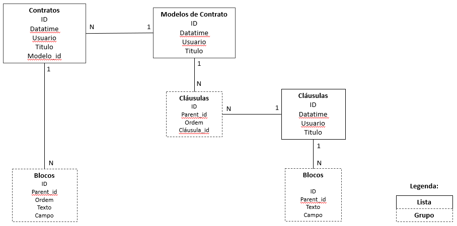
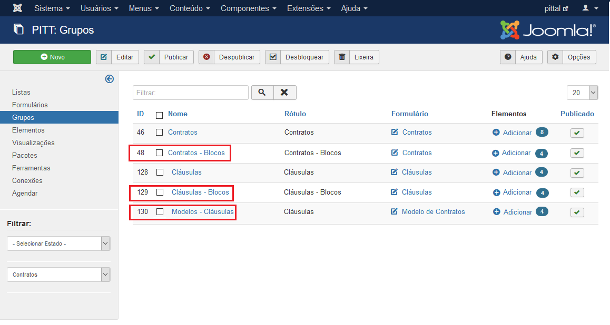
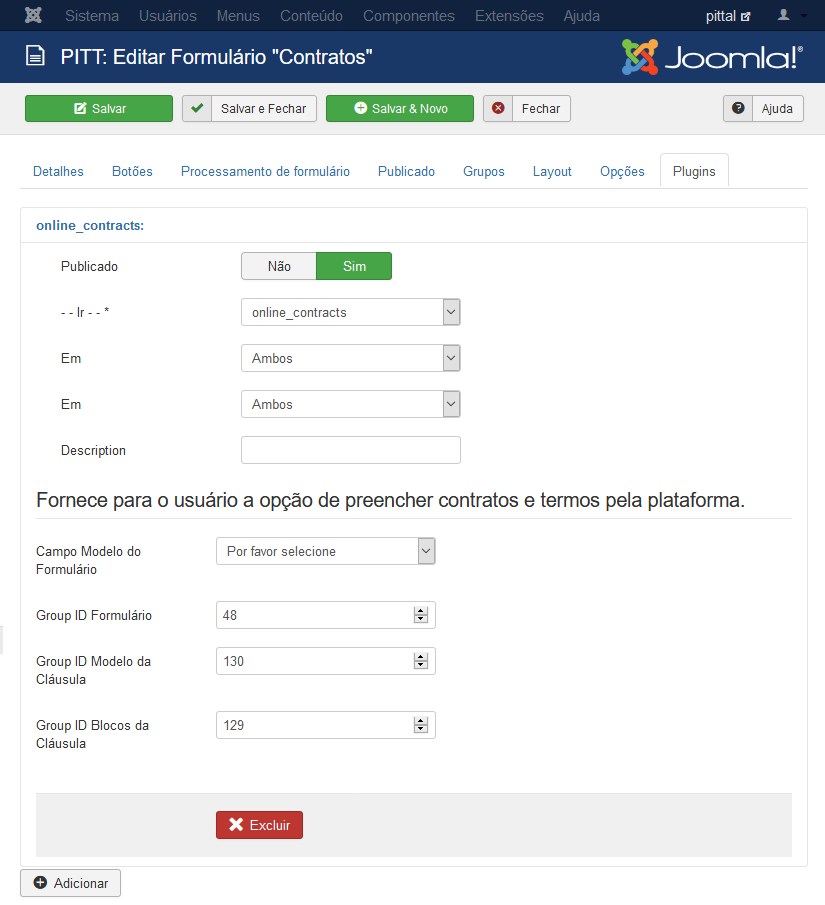

# Online Contracts 2.0
Melhoria do plugin de formulário para criação de contratos, encontrado [aqui](https://github.com/pittufg/online_contracts). O objetivo desse plugin é principalmente a reutilização de cláusulas de contrato já criadas. Cláusulas essas que são constituidas de blocos, contendo um campo e um texto. Sendo assim, uma única cláusula pode possuir vários blocos e poderá pertencer a múltiplos modelos de contratos. Tornando possível o reuso de cláusulas.

## Utilização
Primeiramente é necessário a criação e configuração das listas e grupos no Joomla!, como mostrado na imagem abaixo: 

Posteriormente, carregue o [plg_fabrik_form_online_contracts_2.0.zip](https://github.com/pittufg/online_contracts_2.0/releases) na página de administração do joomla e ative-o. Clique para editar o formulário de **Contratos** e entre na aba de **Plugins**. Clique para **Adicionar** e escolha o plugin **online_contracts**. Selecione o elemento correspondente ao modelo de contrato e digite os três IDs dos grupos criados, sendo respectivamente, grupo de blocos do contrato, grupo de modelos de cláusulas e grupo de blocos da cláusula (todos esses IDs são encontrados na página de **Grupos** da administrações do Fabrik).

